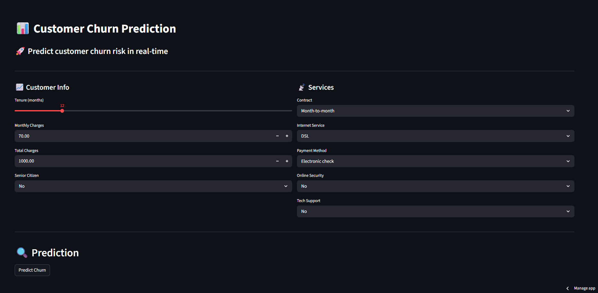
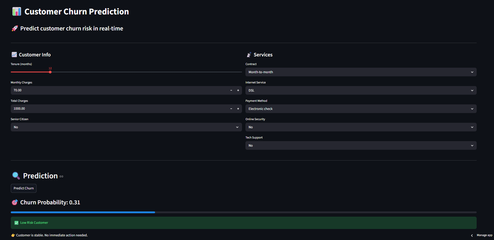

# 📊 Customer Churn Prediction App

⭐ This project demonstrates a complete end-to-end Machine Learning pipeline from data preprocessing to model deployment using Streamlit.
---

## 🚀 Live App
👉 [Click here to use the app](https://customer-churn-predictionrinkesh8430.streamlit.app/)

---

## 📌 Problem Statement
Customer churn is a major problem for businesses. This project predicts whether a customer is likely to leave based on their behavior and service usage.

---

## 🧠 Solution
- Built a Machine Learning model using Random Forest
- Achieved ~86% ROC-AUC
- Deployed using Streamlit for real-time predictions

---

## 📊 Features
- Predict churn probability
- Classify customers into risk categories
- Interactive user interface

---

## 🛠️ Tech Stack
- Python
- Pandas
- Scikit-learn
- Streamlit

---

## 📈 Model Performance
- ROC-AUC: ~0.86
- Accuracy: ~0.81

---
## 📸 App Preview




---

## 📂 How to Run Locally

```bash
streamlit run app.py
